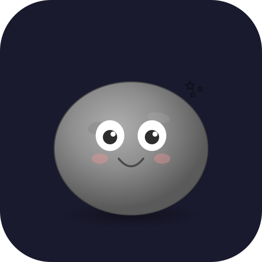

# 🪨 Pet Rock

A virtual pet rock companion app — feed, play, customize, and level up your very own pet rock! Built with vanilla HTML/CSS/JS and available as a desktop app (Windows, macOS, Linux) and mobile app (iOS, Android).



## Features

### Core Gameplay
- **5 Stats** — Happiness, Fullness, Energy, Cleanliness, and Bond
- **8 Actions** — Feed, Play, Polish, Sleep, Talk, Pet, Walk, Music
- **Mood System** — Your rock's expression changes based on its stats (Ecstatic → Miserable)
- **Thought Bubbles** — Your rock shares its feelings and idle thoughts
- **Eye Tracking** — Pupils follow your cursor (desktop) and finger (mobile)
- **Accessibility** — ARIA labels, progressbar roles, live regions, prefers-reduced-motion support
- **Content Security Policy** — CSP meta tag restricts resource loading
- **Auto-save** — Progress saves every 30 seconds and on app close
- **Time-Away Decay** — Stats decrease based on how long you've been away
- **Stat Change Floaters** — Visual "+10 😊" indicators float up when stats change
- **Aging** — Your rock ages over time in day increments

### Rock Paper Scissors Mini-Game
Play RPS against your rock — it picks rock 40% of the time, scissors 30%, and paper 30%.

### Customization System
All options are accessed via the **Customize** panel with 4 tabs:

#### Rock Skins (10 total)
| Skin | Unlock |
|------|--------|
| Granite | Start |
| Marble | Start |
| Obsidian | Level 3 |
| Jade | Level 5 |
| Rose Quartz | Level 7 |
| Lava Rock | Level 10 |
| Gold | Level 14 |
| Crystal | Level 18 |
| Void Stone | Level 22 |
| Rainbow | Level 25 |

#### Eye Styles (6 total)
| Style | Unlock |
|-------|--------|
| Normal | Start |
| Big | Start |
| Anime | Level 4 |
| Sleepy | Level 6 |
| Cyclops | Level 9 |
| Star | Level 12 |

#### Accessories (13 total, SVG-rendered)
| Accessory | Type | Unlock |
|-----------|------|--------|
| None | — | Start |
| Top Hat | Head | Start |
| Bow | Head | Start |
| Shades | Face | Level 2 |
| Flower | Head | Level 4 |
| Headband | Head | Level 5 |
| Party Hat | Head | Level 6 |
| Monocle | Face | Level 8 |
| Headphones | Head | Level 8 |
| Halo | Head | Level 10 |
| Chef Hat | Head | Level 12 |
| Mustache | Face | Level 15 |
| Wizard Hat | Head | Level 20 |

#### Scene Backgrounds (8 total)
| Scene | Unlock | Effects |
|-------|--------|---------|
| Default | Start | — |
| Park | Level 2 | Drifting clouds, trees |
| Beach | Level 5 | Shells |
| Space | Level 8 | Twinkling stars |
| Underwater | Level 11 | Rising bubbles, fish |
| Cozy Room | Level 14 | — |
| Volcano | Level 18 | Lava glow |
| Snowfield | Level 22 | Falling snowflakes |

### Food Variety (8 types)
| Food | Fullness | Happiness | Energy | Unlock |
|------|----------|-----------|--------|--------|
| Pebbles | 15 | 3 | 0 | Start |
| Gravel | 20 | 5 | 0 | Start |
| Quartz Flakes | 12 | 10 | 5 | Start |
| Limestone | 25 | 4 | 0 | Start |
| Geode Slice | 10 | 15 | 10 | Start |
| Lava Cake | 20 | 20 | 5 | Level 6 |
| Diamond Dust | 8 | 25 | 15 | Level 12 |
| Stardust | 15 | 30 | 20 | Level 18 |

### XP & Leveling
- Gain XP from every interaction (1–15 XP depending on action)
- Customization changes grant 1 XP with a 5-second cooldown to prevent farming
- XP threshold increases per level: `30 + level × 20`
- Leveling up triggers an animated overlay and unlocks new content
- Achievements grant bonus XP (+15 each)

### Achievements (20 total)
| Achievement | Requirement |
|-------------|-------------|
| 🍪 First Bite | Feed for the first time |
| 🪨 Mineral Lover | Feed 10 times |
| ⛏️ Quarry Chef | Feed 50 times |
| 🤚 First Touch | Pet for the first time |
| 💕 Pet Whisperer | Pet 50 times |
| 🎾 Playtime! | Play a game |
| ✌️ RPS Champ | Win RPS 5 times |
| 🏃 First Steps | Go for a walk |
| 🗺️ Explorer | Walk 20 times |
| ✨ Shine Bright | Polish 10 times |
| 🎵 DJ Rock | Play music 10 times |
| 💬 Chatterbox | Talk 20 times |
| ❤️ Best Friends | Reach 50 bond |
| 💖 Soulmates | Max out bond to 100 |
| ⬆️ Rising Star | Reach level 5 |
| 🌟 Veteran | Reach level 10 |
| 👑 Legendary | Reach level 20 |
| 💯 Centurion | 100 total interactions |
| 🎂 One Week | Rock is 7 days old |
| 🏆 One Month | Rock is 30 days old |

---

## Quick Start

### Prerequisites
- [Node.js](https://nodejs.org/) v18+ and npm

### Install & Run (Desktop)
```bash
git clone <repo-url>
cd HB_Pet_Rock
npm install
npm start
```

### Build Desktop Installers
```bash
npm run build:win      # Windows (NSIS + portable)
npm run build:mac      # macOS (DMG)
npm run build:linux    # Linux (AppImage + .deb)
npm run build:all      # All platforms
```
Build output goes to the `dist/` directory.

---

## Mobile Builds

### iOS
Requires a Mac with Xcode and an Apple Developer account ($99/year).

```bash
npm run ios:sync       # Sync web assets to iOS project
npm run ios:open       # Open in Xcode
```
Then in Xcode: set your Team, select a device, and run.

See [DEPLOYMENT.md](DEPLOYMENT.md) for App Store submission steps.

### Android
Requires Android Studio and the Android SDK.

```bash
npm run android:sync   # Sync web assets to Android project
npm run android:open   # Open in Android Studio
```
Or build from the command line:
```bash
cd android && ./gradlew assembleDebug
```

See [DEPLOYMENT.md](DEPLOYMENT.md) for Google Play submission steps.

---

## Project Structure

```
HB_Pet_Rock/
├── index.html              # Main game HTML (desktop + source of truth)
├── style.css               # All styling, animations, responsive layout
├── game.js                 # Game logic, state, interactions (~1070 lines)
├── main.js                 # Electron main process
├── preload.js              # Electron preload (context bridge)
├── package.json            # Dependencies, scripts, build config
├── capacitor.config.json   # Capacitor (mobile) configuration
├── icons/
│   ├── icon.svg            # Source icon (vector)
│   └── icon.png            # 512x512 rasterized icon
├── ios-icons/              # Generated iOS icon sizes
├── www/                    # Web assets copied for Capacitor
│   ├── index.html          # Mobile-optimized HTML
│   ├── style.css           # Mobile-responsive CSS
│   └── game.js             # Mobile-adapted JS
├── ios/                    # Xcode project (Capacitor-generated)
│   └── App/
├── android/                # Android Studio project (Capacitor-generated)
│   └── app/
├── .gitignore
└── node_modules/
```

---

## NPM Scripts Reference

| Script | Description |
|--------|-------------|
| `npm start` | Run desktop app via Electron |
| `npm run build` | Build desktop installer for current platform |
| `npm run build:win` | Build Windows installer (NSIS + portable) |
| `npm run build:mac` | Build macOS installer (DMG) |
| `npm run build:linux` | Build Linux installer (AppImage + .deb) |
| `npm run build:all` | Build for all desktop platforms |
| `npm run copy:web` | Copy web files to `www/` for mobile |
| `npm run ios:sync` | Copy + sync to iOS project |
| `npm run ios:open` | Open iOS project in Xcode |
| `npm run ios:run` | Sync + run on iOS device/simulator |
| `npm run android:sync` | Copy + sync to Android project |
| `npm run android:open` | Open Android project in Android Studio |
| `npm run android:run` | Sync + run on Android device/emulator |

---

## Tech Stack

| Component | Technology |
|-----------|-----------|
| Game UI | Vanilla HTML5, CSS3, JavaScript (ES2020) |
| Desktop App | Electron 33+ |
| Desktop Builds | electron-builder 25+ |
| Mobile Wrapper | Capacitor 8+ |
| Icons | Hand-crafted SVG (accessories + app icon) |
| Persistence | localStorage (auto-save) |
| Animations | CSS keyframes + JS DOM manipulation |

---

## License

MIT — do whatever you want with your pet rock. 🪨
